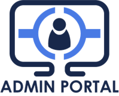
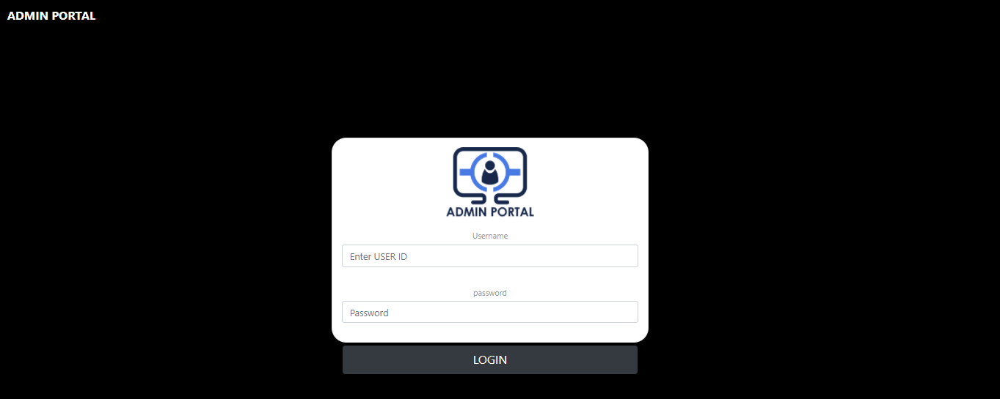
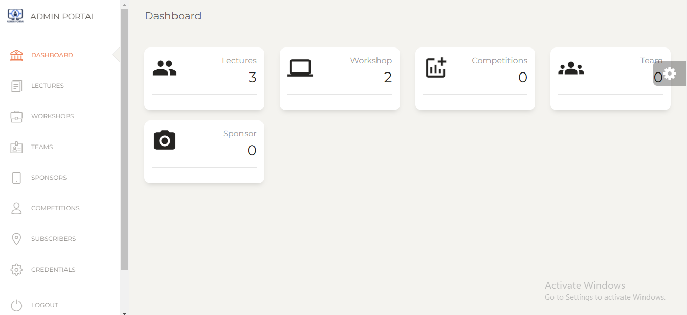
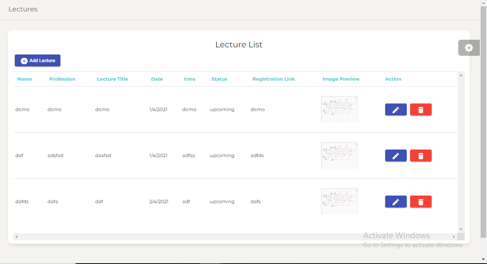

# Admin Portal


<p align="center">
  
</p>


## Table of Contents

- [AdminPortal](#AdminPortal)
  - [Table of Contents](#table-of-contents)
  - [Important Links](#important-links)
  - [About](#about)
  - [Screenshots](#screenshots)
  - [Installation Prerequisites](#installation-prerequisites)
  - [How to Run this for your own society](#how-to-run-for-own-society)
  - [Technology Stack](#technology-stack)
  - [Contributors](#contributors)

## Important Links

[Website Link](https://dbms-project-admin-portal.herokuapp.com/)  

[Windows Installer](https://drive.google.com/file/d/11iNJe0W_Gzqcv5yx8HFjk3kuq04pEcl8/view?usp=sharing)

[Windows Zip Folder](https://drive.google.com/file/d/1x9LI589TEnHGdghd3RXGRVj7DB9a3kHC/view?usp=sharing)

[Linux Zip Folder](https://drive.google.com/file/d/1-Aht0stuyN6mMZr5OO-ZwIEyyJG6A7Yq/view?usp=sharing)

## About

The purpose of this project is to make management of data easy for a a society/club that organizes a lot of events, workshops and competitions for students and professionals. It can be used by the club to manage the details of their events, workshops, competitions, lectures and sponsors in a fast and efficient manner. We have created a user-friendly interface using which one can add new data to the database, remove data from the database and fetch data from the database


## Screenshots









## Installation Prerequisites

- Nodejs

> To Download Nodejs Package [Go to the Nodejs Download Website](https://nodejs.org/en/download/).

- Mongodb

> To install Mongodb [Go to this Website](https://docs.mongodb.com/manual/administration/install-community/)

## How to Run this Website Locally

1. Clone this Repo to your Local Machine.
2. Open The Terminal/CMD in the folder Janhit-Welfare.
3. Type ```mongod``` in your Terminal to Run mongodb Server (Ignore if already Running).
4. Type ```cd backend/jwa && npm install``` to download all the library.
5. Type ```npm start``` to run the nodejs server.
6. Open [localhost:300](localhost:3000/) in your browser.
7. Enjoy!!! :tada: :sparkles:

## Technology Stack

_The following technologies has been used to make this application -_

Main Tech stack used for the project
- _NodeJs_
- _angular_
- _Express_
- _MongoDB_

Database used
- _MongoDB Atlas_

Major libraries used
- _express js_
- _moongoose_
- _jsonwebtoken_
- _cloudinary_
- _electron js_
- _electron-builder_


## Contributors

[Nitish Kumar](https://github.com/Nitish9711)

[Naveen Kumar](https://github.com/NaveenKumar519)


